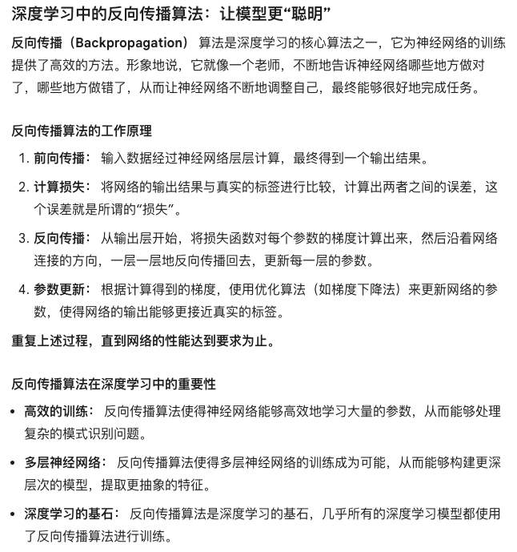
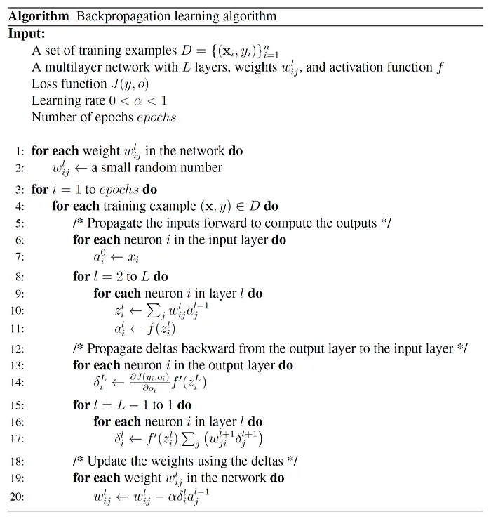

# ErrorBP-NN
Implement the error backpropagation algorithm for neural network.
## Introduction

## References
1. https://medium.com/@sidharth.ss/the-backpropagation-2a19db0fe68f
I refer to this article to understand the backpropagation algorithm.

2. https://machinelearningmastery.com/implement-backpropagation-algorithm-scratch-python
Backpropagation can be used for both classification and regression problems. In classification problems, best results are achieved when the network has one neuron in the output layer for each class value. For example, a 2-class or binary classification problem with the class values of A and B. These expected outputs would have to be transformed into binary vectors with one column for each class value. Such as [1, 0] and [0, 1] for A and B respectively. This is called a one hot encoding. Here, I focus on this case.